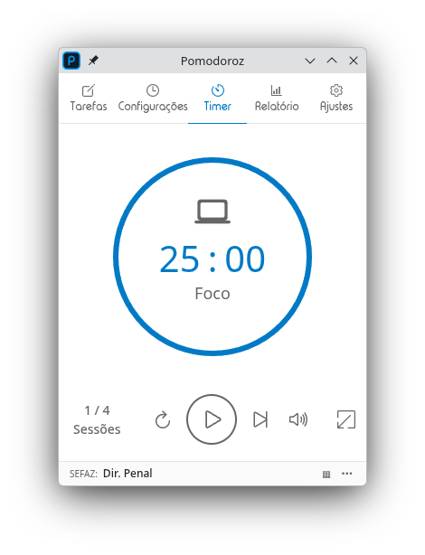
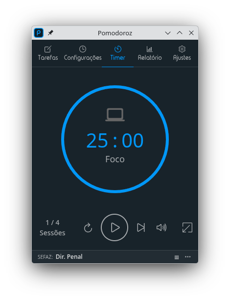

<h1 align="center">Pomodoroz</h1>

<h3 align="center">Flexible focus. Smarter breaks. Real progress.</h3>

<p align="center"><em>Adaptive Focus Timer — 25/5 is a starting point, not a rule.</em></p>

<p align="center">
  <a href="README.pt-BR.md">Portuguese version</a>
</p>

<p align="center">
  <a href="https://github.com/cjdduarte/pomodoroz/releases/latest"></a>
  <a href="https://github.com/cjdduarte/pomodoroz/releases"></a>
  <a href="LICENSE"></a>
</p>

<p align="center">
  
  &nbsp;&nbsp;
  
</p>

<p align="center">
  <br>
  <a href="#-about">About</a>
  .
  <a href="#-features">Features</a>
  .
  <a href="#-installation">Installation</a>
  .
  <a href="#-development">Development</a>
  .
  <a href="#-contributing">Contributing</a>
  .
  <a href="#-privacy">Privacy</a>
  .
  <a href="#-license">License</a>
  <br>
  <br>
</p>

## 🔗 About

**Pomodoroz** is a fork of [Pomatez](https://github.com/zidoro/pomatez) by [Roldan Montilla Jr](https://github.com/roldanjr), started on 2026-03-25. Thanks to the original author for the solid foundation.

### Why does this fork exist?

**Pomatez already supports flexible session timing** (it is not locked to 25/5).  
Pomodoroz is not about "fixing flexibility"; it focuses on adding workflow features for common friction points: starting tasks, choosing what to do next, staying aware of time, and making breaks actually restorative.

### Quick Start (suggested presets)

- **Just Start** — 5 min focus / 1 min break
- **Sprint** — 10 min focus / 3 min break
- **Classic** — 25 min focus / 5 min break
- **Flow** — 50 min focus / 10 min break

### What this fork adds on top of Pomatez

**Task initiation paralysis**

- **Study Rotation Grid** with daily card status.
- **Draw button** to pick the next task when you get stuck on "where do I start?".

**Time awareness**

- **Progressive notifications** (60s and 30s before transitions).
- **Voice assistance** with audio session-status cues.

**Break quality**

- **Fullscreen breaks** to reduce distraction and encourage real rest.
- **0-minute breaks** (auto-skip) when you want to keep momentum.

**Structure on hard days**

- **Strict mode** (no pause/skip/reset once started).
- **Back may count as Idle** for honest mid-focus reset tracking.

**Progress visibility**

- **Statistics module** (daily chart, per-task time, focus/break/idle by period).
- **Per-task-list breakdown** with accumulated time and completed cycles.

**Quality of life**

- **JSON task import/export** (validation + merge/replace).
- **Enhanced compact mode** with expandable grid and actions menu.
- **Custom notification sounds**.
- **Right-click task selection** integrated with Timer flow.

> **Note:** Pomodoroz is a productivity tool, not medical advice. If you have an ADHD diagnosis or suspect you might, seek professional support.

### Evidence and history

- Implemented deliveries: [CHANGELOG.en.md](CHANGELOG.en.md)
- Candidate improvements (not implemented yet): [docs/DECISOES_TECNICAS_2026.en.md#adaptive-focus-candidates](docs/DECISOES_TECNICAS_2026.en.md#adaptive-focus-candidates)

## ✨ Features

### Timer

- Modes: **Focus**, **Short break**, **Long break**, and **Special breaks** (configurable times).
- Controls: start, pause, skip, reset.
- Configurable session rounds.
- **Strict mode** — prevents pausing/skipping/resetting once started.
- **Auto-start** focus after break ends.
- **0-minute breaks** — auto-skip breaks.
- **Progress animation** (can be disabled).

### Tasks

- Create lists and tasks with descriptions.
- Drag-and-drop reordering (lists and cards).
- Mark as done, skip, or delete.
- **Undo/Redo** (Ctrl+Z / Ctrl+Shift+Z).
- **Import/Export** in JSON with validation, ID regeneration, and merge or replace options.

### Study Rotation Grid

- Toggle between **list** and **grid** view.
- Daily card status: white → green → red.
- **Draw button** — random phase-based selection (white→green, then green→red).
- **Columns**: Auto / 1 / 2 / 3 (persistent preference).
- **Grouped mode** — list separators with Group/Ungroup toggle.
- **Color reset** with confirmation and automatic daily reset.
- Right-click selects the active task and navigates to Timer.

### Statistics

- **Periods**: Today, Week (7d), Month (30d), All.
- Summary cards: focus time, break time, idle time, and completed cycles.
- **Daily flow chart** (stacked focus/break/idle).
- **Per-task-list breakdown** with time and cycles.
- Data clearing with confirmation (week, month, or all).

### Compact Mode

- Minimal UI for small screens.
- **Expandable grid** within compact mode.
- Actions menu (done/skip/delete) on task display.
- Post-break prompt to continue or open the grid.

### Notifications

- **None** — no notifications.
- **Normal** — notifies on every break.
- **Extra** — notifies 60s before break, 30s before break ends, and on break start.
- **Custom sound** — default bell or custom audio file.
- **Voice assistance** — audio cue about session status.

### Appearance & System

- **Dark theme** with follow-system-theme option.
- **Native titlebar** — toggle between custom and OS-native.
- **Always on top** — keeps the window above others.
- **Minimize/Close to tray** with progress indicator on tray icon.
- **Open at login** (macOS/Windows).

### Keyboard Shortcuts

- `Alt+Shift+H` — Hide app.
- `Alt+Shift+S` — Show app.
- `Alt+Shift+T` — Toggle theme.
- `Ctrl+Z` / `Ctrl+Shift+Z` — Undo/Redo in Tasks.

### Languages

- Portuguese (BR), English, Spanish, Japanese, Chinese.
- Automatic system language detection.

### Fullscreen Breaks

- Fills the entire screen during breaks to encourage rest.
- Stable across compact/minimized/hidden window states.

## 🚧 Coming Soon

Improvements informed by real feedback from users who deal with focus difficulties and ADHD. See details at [docs/DECISOES_TECNICAS_2026.en.md](docs/DECISOES_TECNICAS_2026.en.md#adaptive-focus-candidates).

- **Cadence presets** — Just Start (5/1), Sprint (10/3), Classic (25/5), Flow (50/10).
- **Extend session** — "+5 min" / "+10 min" when in hyperfocus, without breaking your flow.
- **Break suggestions** — rotating tips (drink water, stretch, breathe) to avoid doomscrolling.

## 💻 Installation

Available for Windows, macOS, and Linux.

Download the latest version from the [Releases page](https://github.com/cjdduarte/pomodoroz/releases/latest).

> **In-app update note:** the automatic in-app channel is currently focused on Windows (NSIS) and Linux (AppImage).

### Local Install Scripts

```sh
./scripts/install.sh
./scripts/install.ps1
./scripts/uninstall.sh
./scripts/uninstall.ps1
```

### Build From Source

```sh
yarn install
yarn build:dir    # Unpacked build
yarn build:linux  # Linux (AppImage, deb, rpm)
yarn build:win    # Windows (portable + setup)
yarn build:mac    # macOS
```

## 🛠️ Development

### Requirements

- Node.js v24
- Yarn Classic (1.x)

### Commands

```sh
yarn dev:app          # Electron + Vite renderer
yarn dev:renderer     # Renderer only (Vite on localhost:3000)
yarn lint             # Monorepo lint/typecheck
yarn build:dir        # Unpacked build
```

### Stack

- Electron 41
- React 19 + Vite 8 + TypeScript 6
- React Router 7 + Redux Toolkit 2
- @dnd-kit (drag-and-drop)
- Styled Components
- i18next
- Lerna 9 + Yarn Classic

## 🤝 Contributing

See [CONTRIBUTING.md](CONTRIBUTING.md) for details.

## 🔒 Privacy

Pomodoroz **does not collect any data**. All information (tasks, settings, statistics) is stored locally on your machine.

## 📄 License

MIT © [Carlos Duarte](https://github.com/cjdduarte)

Original work: MIT © [Roldan Montilla Jr](https://github.com/roldanjr) — [Pomatez](https://github.com/zidoro/pomatez)
