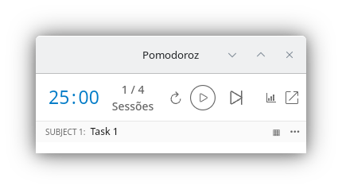
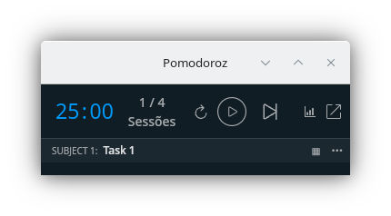
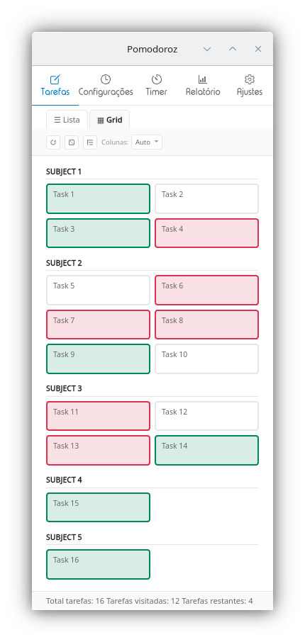
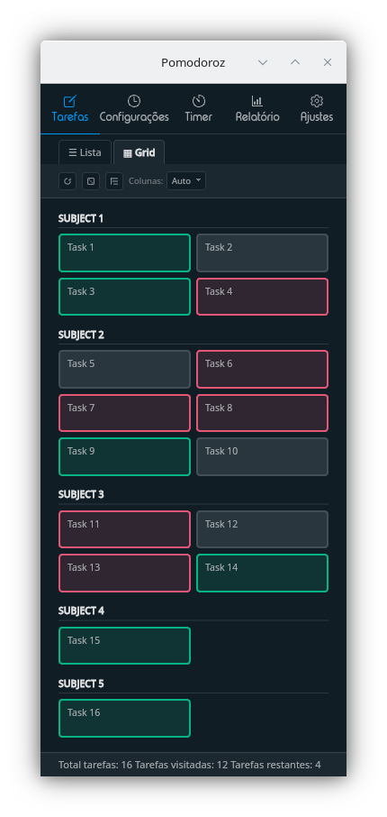

<h1 align="center">Pomodoroz</h1>

<h3 align="center">Foco flexível. Pausa inteligente. Progresso real.</h3>

<p align="center"><em>Timer de foco adaptável — 25/5 é ponto de partida, não regra.</em></p>

<p align="center">
  <a href="README.md">English version</a>
</p>

<p align="center">
  <a href="https://github.com/cjdduarte/pomodoroz/releases/latest"></a>
  <a href="https://github.com/cjdduarte/pomodoroz/releases"></a>
  <a href="LICENSE"></a>
</p>

<p align="center">
  
</p>

<p align="center">
  
</p>

<p align="center">
  
</p>

<p align="center">
  <br>
  <a href="#-sobre">Sobre</a>
  .
  <a href="#-funcionalidades">Funcionalidades</a>
  .
  <a href="#-instalação">Instalação</a>
  .
  <a href="#-desenvolvimento">Desenvolvimento</a>
  .
  <a href="#-contribuindo">Contribuindo</a>
  .
  <a href="#-privacidade">Privacidade</a>
  .
  <a href="#-licença">Licença</a>
  <br>
  <br>
</p>

## 🔗 Sobre

**Pomodoroz** é um fork do [Pomatez](https://github.com/zidoro/pomatez) por [Roldan Montilla Jr](https://github.com/roldanjr), iniciado em 2026-03-25. Agradecimento ao autor original pela base sólida.

### Por que este fork existe?

O **Pomatez já permite configurar tempos livremente** (não é preso ao 25/5).  
O objetivo do Pomodoroz não é "corrigir flexibilidade", e sim adicionar recursos de fluxo para fricções comuns na rotina: iniciar tarefas, decidir o próximo passo, manter noção de tempo e fazer pausas de verdade.

### Pomatez vs Pomodoroz (visão rápida)

| Área                            | Pomatez (original)                                                                             | Pomodoroz (este fork)                                                                                             |
| ------------------------------- | ---------------------------------------------------------------------------------------------- | ----------------------------------------------------------------------------------------------------------------- |
| Arquitetura de runtime          | Workspace misto (`app/electron` + `app/tauri`) com scripts legados de Electron ainda presentes | Runtime Tauri-only com `src-tauri/` dedicado e sem caminho de execução Electron                                   |
| Base de frontend                | React 16                                                                                       | React 19                                                                                                          |
| Gerenciador de pacotes          | Yarn (histórico)                                                                               | pnpm                                                                                                              |
| Base Tauri                      | Tauri 2 (alpha)                                                                                | Tauri `2.10.x`, com capabilities explícitas e plugins pinados                                                     |
| Navegação principal             | Lista de tarefas, Config, Timer, Ajustes                                                       | Adiciona rota de **Estatísticas** (filtros por período, detalhamentos e limpeza de histórico)                     |
| Fluxo de tarefas                | Gestão de tarefas focada em lista                                                              | Adiciona **Grade de Rotação de Estudos** (lista/grade, ciclo diário de cores, Sortear, clique direito para Timer) |
| Importação/Exportação de listas | Sem fluxo dedicado (dados ficam apenas no armazenamento local interno)                         | Adiciona **importação/exportação JSON de listas/cartões** com validação e modos merge/substituição                |
| Noção de tempo                  | Níveis de notificação                                                                          | Adiciona seleção de som customizado + opção de registrar reset de foco como ocioso                                |
| Idiomas                         | en/es/ja/zh                                                                                    | Adiciona pt-BR (`pt`) e mantém os idiomas existentes                                                              |

> Data da comparação: 2026-04-21.

### Começo rápido (sugestões)

- **Só começa** — 5 min foco / 1 min pausa
- **Sprint** — 10 min foco / 3 min pausa
- **Clássico** — 25 min foco / 5 min pausa
- **Flow** — 50 min foco / 10 min pausa

### O que este fork adiciona sobre o Pomatez

**Paralisia de início**

- **Grade de Rotação de Estudos** com status diário por cartão.
- **Botão Sortear** para escolher a próxima tarefa quando você trava no "por onde começo?".

**Noção de tempo**

- **Notificações progressivas** (60s e 30s antes das transições).
- **Assistente de voz** com aviso sonoro de status da sessão.

**Qualidade de pausa**

- **Tela cheia nas pausas** para reduzir distrações e incentivar descanso.
- **Pausas de 0 minuto** (auto-skip) quando você quer manter o ritmo.

**Estrutura em dias difíceis**

- **Modo rigoroso** (sem pausar/pular/resetar após iniciar).
- **Voltar pode contar como Ocioso** para registrar reset de foco de forma honesta.

**Visibilidade de progresso**

- **Módulo de Estatísticas** (gráfico diário, tempo por tarefa, foco/pausa/ocioso por período).
- **Detalhamento por lista de tarefas** com tempo acumulado e ciclos completos.

**Qualidade de vida**

- **Importação/Exportação de listas e tarefas** em JSON (validação + merge/substituição).
- **Modo compacto aprimorado** com grade expansível e menu de ações.
- **Som de notificação customizável**.
- **Seleção de tarefa por clique direito** com integração ao Timer.

> **Nota:** Pomodoroz é uma ferramenta de produtividade, não orientação médica. Se você tem um diagnóstico de TDAH ou suspeita, procure acompanhamento profissional.

### Evidências e histórico

- Entregas implementadas: [CHANGELOG.md](CHANGELOG.md)
- Roadmap de melhorias pendentes: [docs/IMPROVEMENTS.md](docs/IMPROVEMENTS.md)
- Referência de encerramento da migração: [docs/MIGRATION_TO_TAURI.md](docs/MIGRATION_TO_TAURI.md)

## ✨ Funcionalidades

### Timer

- Modos: **Foco**, **Pausa curta**, **Pausa longa** e **Pausas especiais** (horários configuráveis).
- Controles: iniciar, pausar, pular, resetar.
- Rodadas de sessão configuráveis.
- **Modo rigoroso** — impede pausar/pular/resetar uma vez iniciado.
- **Início automático** do foco após a pausa.
- **Breaks de 0 minutos** — pula a pausa automaticamente.
- **Animação de progresso** (desativável).

### Tarefas

- Criar listas e tarefas com descrição.
- Arrastar e soltar para reordenar (listas e cartões).
- Marcar como concluído, pular ou excluir.
- **Desfazer/Refazer** (Ctrl+Z / Ctrl+Shift+Z).
- **Importação/Exportação** em JSON com validação, regeneração de IDs e opção merge ou substituição.

### Grade de Rotação de Estudos

- Alternância entre visualização em **lista** e **grade**.
- Status diário por cartão: branco → verde → vermelho.
- **Botão Sortear** — seleção aleatória por fase (branco→verde, depois verde→vermelho).
- **Colunas**: Auto / 1 / 2 / 3 (preferência persistente).
- **Modo agrupado** — separadores por lista com toggle Agrupar/Desagrupar.
- **Reset de cores** com confirmação e reset automático diário.
- Clique direito seleciona a tarefa ativa e navega ao Timer.

### Estatísticas

- **Períodos**: Hoje, Semana (7d), Mês (30d), Tudo.
- Cartões resumo: tempo de foco, pausa, ocioso e ciclos completos.
- **Gráfico diário** (foco/pausa/ocioso empilhados).
- **Detalhamento por lista de tarefas** com tempo e ciclos.
- Limpeza de dados com confirmação (semana, mês ou tudo).

### Modo Compacto

- Interface mínima para telas pequenas.
- **Grade expansível** dentro do modo compacto.
- Menu de ações (concluir/pular/excluir) no display de tarefa.
- Prompt pós-pausa para continuar ou abrir a grade.

### Notificações

- **Nenhuma** — sem notificação.
- **Normal** — notifica a cada pausa.
- **Extra** — notifica 60s antes da pausa, 30s antes do fim e no início.
- **Som customizável** — sino padrão ou arquivo de áudio personalizado.
- **Assistente de voz** — aviso sonoro sobre status da sessão.

### Aparência e Sistema

- **Tema escuro** com opção de seguir o tema do sistema.
- **Barra de título nativa** — alterna entre custom e nativa do SO.
- **Sempre no topo** — mantém a janela acima das demais.
- **Minimizar/Fechar para bandeja** com indicador de progresso no ícone.
- **Abrir no login** (macOS/Windows).

### Atalhos de Teclado

- `Alt+Shift+H` — Ocultar app.
- `Alt+Shift+S` — Mostrar app.
- `Alt+Shift+T` — Alternar tema.
- `Ctrl+Z` / `Ctrl+Shift+Z` — Desfazer/Refazer em Tarefas.

### Idiomas

- Português (BR), Inglês, Espanhol, Japonês, Chinês.
- Detecção automática do idioma do sistema.

### Tela cheia durante pausas

- Ocupa a tela inteira durante a pausa para incentivar o descanso.
- Estabilidade em estados compacto/minimizado/oculto.

## 🚧 Em desenvolvimento

Melhorias pensadas a partir de feedback real de usuários que lidam com dificuldade de foco e TDAH. Veja detalhes em [docs/IMPROVEMENTS.md](docs/IMPROVEMENTS.md).

- **Presets de cadência** — Só começa (5/1), Sprint (10/3), Clássico (25/5), Flow (50/10).
- **Estender sessão** — "+5 min" / "+10 min" quando estiver em hiperfoco, sem perder o ritmo.
- **Sugestão de pausa** — dicas rotativas (beber água, alongar, respirar) para evitar doomscroll.

## 💻 Instalação

Os artefatos publicados em Release atualmente cobrem Windows e Linux.
Build para macOS está disponível via código-fonte (`pnpm tauri build`).

Baixe a versão mais recente na [página de Releases](https://github.com/cjdduarte/pomodoroz/releases/latest).

> **Nota de update in-app:** o canal automático no app está focado atualmente em Windows (NSIS) e Linux (AppImage).

### Scripts de instalação local

```sh
./scripts/install.sh
./scripts/install.ps1
./scripts/uninstall.sh
./scripts/uninstall.ps1
```

### Compilar do Código-Fonte

```sh
pnpm install
pnpm build:renderer
pnpm tauri build --no-bundle
pnpm tauri build --bundles appimage,deb,rpm
pnpm tauri build --bundles nsis
```

## 🛠️ Desenvolvimento

### Requisitos

- Node.js v24
- pnpm v10

### Comandos

```sh
pnpm dev:app          # Tauri + Vite renderer
pnpm lint             # Lint (renderer)
pnpm typecheck:renderer
pnpm tauri build --no-bundle
```

### Stack

- Tauri 2
- React 19 + Vite 8 + TypeScript 6
- React Router 7 + Redux Toolkit 2
- @dnd-kit (arrastar e soltar)
- Styled Components
- i18next
- Scripts pnpm centralizados no root, com shell do renderer em `app/renderer` e backend nativo em `src-tauri`

## 🤝 Contribuindo

Veja [CONTRIBUTING.md](CONTRIBUTING.md) para detalhes.

## 🔒 Privacidade

Pomodoroz **não coleta nenhum dado**. Todas as informações (tarefas, configurações, estatísticas) ficam armazenadas localmente na sua máquina.

## 📄 Licença

MIT © [Carlos Duarte](https://github.com/cjdduarte)

Trabalho original: MIT © [Roldan Montilla Jr](https://github.com/roldanjr) — [Pomatez](https://github.com/zidoro/pomatez)
